# Development Dispatch pipeline: commit -> category -> translation -> Composer -> News

This is the top-level map of everything a GitHub commit can become on this
site. It ties together three independent systems that all start from the
same `dispatch_entries` row but never depend on each other's output:

1. **Categorization** -- which of 9 categories the commit belongs to
   (`api/dispatch-helpers.php`, `pw_dispatch_categorize()`).
2. **Translation** -- turning the raw commit into an approved, reader-safe
   public explanation (deep-dive: `docs/dispatch-spacy.md`).
3. **Composer** -- an admin manually writing a blog-style News post that
   uses approved dispatches as reference material, never as generated text.

## Master flow

```mermaid
flowchart TD
    A[GitHub push webhook] --> C{SHA already in dispatch_entries?}
    RS[Admin: Force Re-sync] --> C
    C -- Yes, skip --> Z1[Ignored -- INSERT IGNORE no-ops]
    C -- No, new commit --> D[Read subject / body / changed files]
    D --> E["Compute safe diff-context: file-type + product-area\nlabels only (never raw paths/diffs/code)"]
    E --> F[(INSERT dispatch_entries row)]

    F --> CAT1
    F --> TRN1

    subgraph CAT["Categorization -- pw_dispatch_categorize()"]
      direction TB
      CAT1["Score all 9 categories from 4 signals:\nprefix +65, subject keyword +50,\nbody keyword +20, diff-context +45"]
      CAT2[Highest score wins;\nties keep fixed priority order]
      CAT3["Confidence = margin-aware score (0-100)"]
      CAT4{Confidence >= 65%?}
      CAT1 --> CAT2 --> CAT3 --> CAT4
      CAT4 -- Yes --> CAT5["category_source = auto\nno review needed"]
      CAT4 -- No --> CAT6["Flagged: Home 'needs review' queue\n+ Dispatch Control badge/toggle"]
      CAT6 --> CAT7[Admin reviews in Dispatch Control]
      CAT7 --> CAT8["category_source = manual, confidence = 100\nlogged to dispatch_category_overrides"]
    end

    subgraph TRN["Translation -- see docs/dispatch-spacy.md + docs/dispatch-embeddings.md for full detail"]
      direction TB
      TRN1["Deterministic PHP planner: recognized action,\ndomain, dictionary terms, safe file scope"]
      TRN2{Optional spaCy/RapidFuzz\nworker available?}
      TRN1 --> TRN2
      TRN2 -- No/timeout --> TRN3[PHP-only plan]
      TRN2 -- Yes --> TRN4["spaCy hints + RapidFuzz reviewed-concept\nfuzzy match (needs 92+ score, 4pt lead)"]
      TRN1 --> TRNE1["Encode current commit (one-shot proc_open)\n+ PHP cosine similarity vs cached corpus"]
      TRNE1 --> TRNE2{"Cached match >= 0.75?"}
      TRNE2 -- Yes --> TRNE3["best_semantic_match: read-only\n'Similar past Dispatch' editor reference"]
      TRN3 --> TRN5[Build BH-4 reader-safe draft]
      TRN4 --> TRN5
      TRNE2 --> TRN5
      TRN5 --> TRN6["Score confidence: subject 25, dictionary 10,\nintent 30, body 10, file-scope 20,\nsemantic 5 (spaCy domain hint OR embedding match)"]
      TRN6 --> TRN7{"High (>=65% + independent\nsignals) AND no RapidFuzz\nconcept used?"}
      TRN7 -- Yes --> TRN8[(Auto-publish to dispatch_translations)]
      TRN7 -- No --> TRN9["Private draft: editor review queue\n(shows TRNE3 panel when present)"]
      TRN9 --> TRN10[Editor approves / edits / regenerates]
      TRN10 --> TRN8
      TRN8 --> TRNE4["Cache this approved translation's embedding\n(pw_dispatch_update_translation_embedding)\n-- grows the corpus TRNE1 compares against next time"]
    end

    TRN8 --> G["Public Dispatch page: approved translation\nshown first, BH-4 technical record as fallback"]

    G --> H{Admin wants a blog-style\nNews post about this work?}
    H -- No --> I[Stays a public Dispatch only]
    H -- Yes --> CMP1

    subgraph CMP["Dispatch Composer -- fully manual writing"]
      direction TB
      CMP1[Admin creates/opens a Composer draft]
      CMP2["Search approved dispatches\n(filter: category / date / keyword / unused-only)"]
      CMP3["Attach as reference material:\nreorder, private notes, 'Insert summary'\n(plain text, not a live link)"]
      CMP4["Admin manually writes title, excerpt,\nfeatured image, body"]
      CMP5[Save Draft / Mark Ready]
      CMP6["Preview -- renders through the\nreal public news-post.js renderer"]
      CMP7{Publish?}
      CMP1 --> CMP2 --> CMP3 --> CMP4 --> CMP5 --> CMP6 --> CMP7
      CMP7 -- Validation fails --> CMP4
      CMP7 -- Passes --> CMP8["Transactional publish: row locked,\nreuses pw_news_create_post(),\nduplicate-publish safe"]
      CMP8 --> CMP9[Composer post becomes read-only,\nlinked to the new News post]
    end

    CMP9 --> J[Public News page]
```

## What each system owns, and what it never touches

| | Categorization | Translation | Composer |
|---|---|---|---|
| Reads | subject, body, diff-context | subject, body, diff-context | approved `dispatch_translations` rows only |
| Writes | `dispatch_entries.tag/category_confidence/category_source` | `dispatch_translations` / `dispatch_translation_drafts` | `dispatch_composer_posts/items`, then a real `news_posts` row on publish |
| Automatic? | Fully automatic, human can correct | Automatic draft + auto-publish above the confidence gate; otherwise queued for a human | Fully manual -- there is no automatic path from dispatch to News post |
| Confidence gate | 65% (needs_review below that) | 65% + independent signals (same floor, separate score) | N/A -- publish validation is pass/fail, not confidence-scored |
| Human review trail | `dispatch_category_overrides` (every explicit save, corrected or confirmed) | Existing editor approve/edit/regenerate actions in Translation Review | `admin_activity_log` (`dispatch_composer_*` actions) |

## Key invariant

Categorization and Translation run on **every** new commit, independently of
each other and of Composer. Composer only ever *reads* whatever Translation
already approved -- it has no code path that creates a dispatch, changes a
category, or writes a translation. The only thing that ever creates a public
`news_posts` row from this pipeline is a human clicking Publish in Composer,
or a human publishing directly through News Management (unrelated to
Dispatches entirely).
