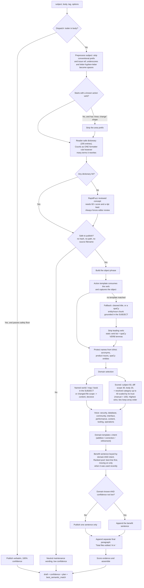

# Development Dispatch pipeline: commit -> category -> translation -> Composer -> News

This is the top-level map of everything a GitHub commit can become on this
site. It ties together three systems that all start from the same
`dispatch_entries` row:

1. **Categorization** -- which of 9 categories the commit belongs to
   (`api/dispatch-helpers.php`, `pw_dispatch_categorize()`).
2. **Translation** -- turning the raw commit into an approved, reader-safe
   public explanation (deep-dive: `docs/dispatch-spacy.md`).
3. **Composer** -- an admin manually writing a blog-style News post that
   uses approved dispatches as reference material, never as generated text.

Categorization and Translation used to be fully independent. **They are not
any more:** Translation now reads the resolved category, its confidence, and
whether a human corrected it, and weights the reader-facing voice accordingly.
That is the one deliberate link between them, described under "Master flow"
and again in `docs/dispatch-spacy.md`. Composer remains strictly downstream of
both and never writes back.

## Master flow

```mermaid
flowchart TD
    A[GitHub push webhook] --> A1{HMAC signature valid?}
    A1 -- No --> A2[401, stop]
    A1 -- Yes --> A3{"repository.full_name is the expected repo?"}
    A3 -- No --> A4["403 + webhook_repository_rejected audit entry"]
    A3 -- Yes --> C
    RS[Admin: Force Re-sync] --> C
    C{SHA already in dispatch_entries?}
    C -- Yes, skip --> Z1[Ignored -- INSERT IGNORE no-ops]
    C -- No, new commit --> D["Split message: line 1 = subject, remainder = body"]
    D --> E["Compute safe diff-context: file count + file-type\nand product-area labels only (never raw paths/diffs/code)"]
    E --> CAT1

    subgraph CAT["Categorization -- pw_dispatch_categorize()"]
      direction TB
      CAT1["Score all 9 categories from 4 signals:\nprefix +65, subject keyword +50,\nbody keyword +20, diff-context +45"]
      CAT2[Highest score wins;\nties keep fixed priority order]
      CAT3["Confidence = margin-aware score (0-100)"]
      CAT1 --> CAT2 --> CAT3
    end

    CAT3 --> F[("INSERT IGNORE dispatch_entries:\nsha, subject, body, tag,\ncategory_confidence, category_source")]
    F --> CAT4{Confidence >= 65%?}
    CAT4 -- Yes --> CAT5["category_source = auto, no review needed"]
    CAT4 -- No --> CAT6["Flagged: Home 'needs review' queue\n+ Dispatch Control badge/toggle"]
    CAT6 --> CAT7[Admin corrects in Dispatch Control]
    CAT7 --> CAT8["category_source = manual, confidence = 100\nlogged to dispatch_category_overrides"]

    F --> TRN1
    CAT8 -.->|"re-generating later reads the corrected tag"| TRN1

    subgraph TRN["Translation -- full detail in the second chart below"]
      direction TB
      TRN1["Load entry + category_confidence/category_source"]
      TRN1 --> TRN2{"Dispatch: trailer in the commit body?"}
      TRN2 -- "Yes, passes safety floor" --> TRN2A["Publish verbatim, 100% confidence,\nnothing inferred"]
      TRN2 -- No --> TRN3["Deterministic PHP planner + optional\nlocal spaCy / RapidFuzz / embedding signals\n(each fails open independently)"]
      TRN3 --> TRN6["Score confidence: subject 25, dictionary 10,\nintent 30, body 10, file-scope 20, semantic 5;\n2+ formatter rules forces the 65% floor"]
      TRN2A --> TRN7
      TRN6 --> TRN7{"High confidence AND no RapidFuzz\nconcept used?"}
      TRN7 -- Yes --> TRN8[("Auto-publish to dispatch_translations")]
      TRN7 -- No --> TRN9["Private draft: editor review queue\n(dispatch_translation_drafts)"]
      TRN9 --> TRN10["Editor reviews in Dispatch Translations"]
      TRN10 --> TRN11["Regenerate Draft (preview mode:\nwrites nothing, live text untouched)"]
      TRN11 --> TRN10
      TRN10 --> TRN8
      TRN8 --> TRNE4["Cache this approved translation's embedding\n-- grows the corpus future drafts compare against"]
    end

    TRN8 --> G["Public Dispatch page: approved translation first,\nBH-4 Technical Analysis transcript behind it"]

    TRN8 --> QA1["Admin rates Good / Bad (dispatch_translation_feedback)"]
    TRN8 --> QA2["Edit-similarity logged automatically\n(dispatch_translation_edit_events)"]
    QA1 --> QA3["Weekly cron: generate-quality-report.php"]
    QA2 --> QA3
    QA3 --> QA4["Admin: Translation Quality -- good/bad ratio,\nper-category bad rates, weak clusters.\nAdvisory only: nothing rewrites the engine"]
    QA3 -.->|"a badly-rated dispatch is excluded from\nfuture 'similar past Dispatch' matches"| TRNE4

    G --> H{Admin wants a blog-style\nNews post about this work?}
    H -- No --> I[Stays a public Dispatch only]
    H -- Yes --> CMP1

    subgraph CMP["Dispatch Composer -- fully manual writing"]
      direction TB
      CMP1[Admin creates/opens a Composer draft]
      CMP2["Search approved dispatches\n(approved = has a dispatch_translations row)"]
      CMP3["Attach as reference material:\nreorder, private notes, 'Insert summary'\n(flat editable text, not a live link)"]
      CMP4["Admin manually writes title, excerpt,\nfeatured image, body"]
      CMP5[Save Draft / Mark Ready]
      CMP6["Preview -- returns the exact api/news/get.php\nshape, rendered by the real public renderer"]
      CMP7{Publish?}
      CMP1 --> CMP2 --> CMP3 --> CMP4 --> CMP5 --> CMP6 --> CMP7
      CMP7 -- Validation fails --> CMP4
      CMP7 -- Passes --> CMP8["Transactional publish: row SELECT ... FOR UPDATE,\nreuses pw_news_create_post(), duplicate-publish safe"]
      CMP8 --> CMP9[Composer post becomes read-only,\nlinked to the new News post]
    end

    CMP9 --> J["Public News article + 'Related Development' sidecard\n(attached dispatches, category breakdown bar)"]
    CMP9 --> K["news_published notifications (publisher skipped)"]
```

## Translation engine detail

## What each system owns, and what it never touches

| | Categorization | Translation | Composer |
|---|---|---|---|
| Reads | subject, body, diff-context | subject, body, diff-context, **and the resolved category + its confidence/source** | approved `dispatch_translations` rows only |
| Writes | `dispatch_entries.tag/category_confidence/category_source` | `dispatch_translations` / `dispatch_translation_drafts` / `dispatch_translation_embeddings` | `dispatch_composer_posts/items`, then a real `news_posts` row on publish |
| Automatic? | Fully automatic, human can correct | Automatic draft + auto-publish above the confidence gate; otherwise queued for a human | Fully manual -- there is no automatic path from dispatch to News post |
| Confidence gate | 65% (needs_review below that) | 65% + independent signals (same floor, separate score) | N/A -- publish validation is pass/fail, not confidence-scored |
| Human review trail | `dispatch_category_overrides` (every explicit save) | `dispatch_translation_feedback` + `dispatch_translation_edit_events`, surfaced in the weekly quality report | `admin_activity_log` (`dispatch_composer_*` actions) |

## Invariants

**The commit body never reaches reader-facing copy.** It contributes to
confidence scoring and to domain selection at reduced weight, and that is all.
Two separate production bugs came from this boundary leaking -- a quoted commit
title lifted verbatim into a published summary via spaCy, and lore words in a
body forcing the worldbuilding voice onto an engineering change. Both paths are
now subject-scoped. Treat any new use of `$bodyContext` in wording as a bug.

**A commit's own action verb never survives into the reader-facing noun slot.**
The action template consumes it; the two fallback paths strip it explicitly.
Every verb the engine recognizes as an opening has a template able to consume
it -- that gap is checked and must stay at zero.

**The category informs the voice but can never override the commit.** A subject
keyword (50) outranks even a hand-corrected category (40), because the category
is itself partly derived from the same subject and body; treating it as
independent proof would double-count that evidence.

**Auto-publication needs two independent signals.** `rulesMatched >= 2` alone
forces the 65% floor and clears the gate, which is why the dictionary counts as
a single rule no matter how many terms it rewrites. A RapidFuzz concept match
always forces editor review and can never auto-publish by itself.

**Every optional local worker fails open.** spaCy/RapidFuzz and the embeddings
worker are separate one-shot processes with their own budgets. If either is
missing, slow, or errors, PHP falls back to deterministic rules and publication
thresholds are unchanged. Neither calls an external service, and no prior
translation's text ever crosses the PHP/Python boundary.

**Regeneration is non-destructive.** Re-running the engine over an
already-published dispatch uses preview mode, which writes nothing; the live
public text is replaced only by an explicit save. Deleting a translation to
regenerate it is never necessary and loses the row's quality feedback.

**Composer only ever reads.** It has no code path that creates a dispatch,
changes a category, or writes a translation. The only way this pipeline creates
a public `news_posts` row is a human clicking Publish in Composer -- or a human
publishing directly through News Management, which is unrelated to Dispatches
entirely.

**The quality report is advisory.** It aggregates ratings, edit-similarity and
weak clusters, but nothing in it rewrites the engine's weights, thresholds or
dictionary -- those are source code, not settings. The one automatic rule is
narrow and safe by construction: a dispatch rated more Bad than Good is
excluded from ever being offered as a "similar past Dispatch" reference again.
