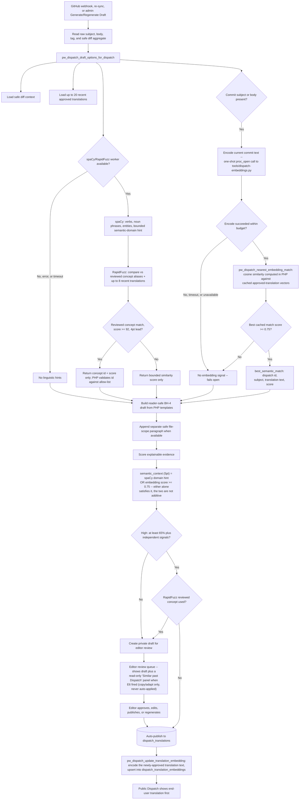

# Optional local language enrichment for Dispatch drafts

The Dispatch translator remains rule-based and deterministic. spaCy is an
optional local language-analysis step: it extracts verbs, noun phrases, and
named terms, plus conservative vector-based domain hints so a vague raw commit
can retain its useful reader-facing subject. RapidFuzz is an optional local
lexical-matching step in the same worker. It compares a commit against a small,
reviewed concept library and detects close wording against recent approved
translations.

The worker returns only a concept id and bounded scores to PHP; it never returns
another translation's text or writes reader-facing prose. PHP validates the
concept id against its own allow-list before using the corresponding approved
reader-safe object. A fuzzy concept match can shape a private draft, but it
always requires editorial review and cannot cause auto-publication. spaCy and
RapidFuzz do not call an AI or send commit text outside the hosting account. If
the worker is unavailable or exceeds its 6-second budget, PHP uses the existing
rule-only translation without changing auto-publication.

A second, independent local worker (`docs/dispatch-embeddings.md`) adds real
sentence-embedding semantic similarity alongside spaCy/RapidFuzz -- same
fail-open contract, same "PHP owns all reader-facing prose" rule, different
venv, different signal. It contributes a graded confidence signal and a
read-only "Similar past Dispatch" editor reference; it never writes a draft.

## End-to-end translation flow

This is the current implementation flow, suitable as the source for a visual
flowchart. The PHP formatter is the authority for every reader-facing sentence;
both Python workers can only return bounded, local analysis signals.



The embedding lookup (E1-E6) and the spaCy/RapidFuzz lookup (D1-D6) run
independently off the same draft-options step and never depend on each
other's output -- either, both, or neither can contribute to a given draft.
The corpus the embedding lookup compares against only grows at R1, right
after a translation actually gets approved (whether by auto-publish or by an
editor's manual save) -- so the very first commit of a kind has nothing to
match against, but every similar commit after it does.

### What each stage is allowed to do

- **Input and scope:** commit subject/body are used only inside the hosting
  account. Stored diff context contains only a file count and approved product
  area/type labels—never raw paths, diffs, or source code.
- **Deterministic PHP planner:** identifies explicit local facts and chooses the
  approved BH-4 wording template. It remains the sole source of public prose.
- **spaCy:** supplies local verbs, noun phrases, named terms, semantic-domain
  hints, and similarity scores. These are supporting context only.
- **RapidFuzz:** runs locally in the same worker. It compares current wording
  with the reviewed aliases in `tools/dispatch-fuzzy-concepts.json` and checks
  textual similarity against recent approved translations. A concept is usable
  only when its score is at least 92 and at least four points ahead of the next
  candidate. PHP then revalidates the returned id against its own allow-list.
  It never returns another translation's prose to PHP.
- **Embeddings worker (separate, `docs/dispatch-embeddings.md`):** encodes
  only the current commit's text via a one-shot `proc_open` process. PHP
  owns the cached corpus (`dispatch_translation_embeddings`) and computes
  cosine similarity itself -- the worker never sees, stores, or returns
  another translation's text. A match at or above 0.75 contributes to the
  same `semantic_context` evidence slot spaCy's domain hint feeds (either
  alone satisfies it) and surfaces as a read-only editor reference; it never
  writes to a draft.
- **Safety gate:** a validated RapidFuzz concept can improve a private draft but
  always sets `requires_editor_review`; it cannot auto-publish. A missing,
  failing, or slow worker produces the normal deterministic result instead.
  The same fail-open contract applies to the embeddings worker independently.
- **Output:** the public page displays an approved end-user explanation first;
  the original technical record remains separately available through BH-4's
  technical analysis.

## Draft planning and confidence

PHP builds a reader-safe plan before writing each draft: intent, affected
domain, allow-listed changed-file scope, and optional semantic support. It then
uses a domain-specific BH-4 voice for security, database, performance,
community, content, interface, and operations work. No raw paths, diffs, or
commit-body copy is exposed in the public draft.

Confidence is evidence-based and explainable. Recognized subject, commit
intent, body context, changed-file scope, and semantic context contribute to a
score; vector context is capped at a small supporting weight and can never make
an unsupported draft high confidence on its own. Vector domains resolve only a
genuinely unclassified commit and never replace an explicit local domain cue.
Named worlds, maps, districts, books, and worldbuilding scope are decisive
content cues before broad technical terms are evaluated.

World-release records headed by `Unlock <World>` have an additional deterministic
planner. It uses only stated facts—world name, full map, clickable district count,
and landmarks—to produce a concrete public update rather than generic content
language.

For every domain, the formatter preserves an action-led source title before it
applies a reader-safe replacement. If a replacement becomes a noun phrase, the
original action is retained and the new phrase becomes its object; this prevents
phrases such as “made unlock…” or “fixed fix…” across the engine. Run
`php tools/test-dispatch-translator.php` on the server after translator changes.
High confidence still requires multiple independent signals, preserving the
existing auto-publication safety gate.

The visible **Confidence score** help control in Admin → Dispatch Translations
uses these exact weights: recognized subject **25**, reviewed reader-safe
dictionary **10**, commit intent **30**, body context **10**, safe changed-file
scope **20**, and optional semantic context **5**. Two independent deterministic
formatter rules establish a 65% floor for older records that do not have stored
diff context. High confidence requires at least 65% and independent evidence;
otherwise the draft is medium or low confidence and stays in the review queue.

The reviewed RapidFuzz concept library is stored in
`tools/dispatch-fuzzy-concepts.json`. It contains ids, aliases, and PHP-owned
reader-safe objects for narrow, recurring project concepts. Add an alias only
when it is a genuine synonym or likely typo variation of a reviewed concept;
do not use it as a broad keyword list. Run `php tools/test-dispatch-translator.php`
after changing this library or the matching threshold.

## Reader-safe terminology dictionary

Before the generic action templates run, PHP applies a narrow, reviewed
dictionary of recurring project terminology. It converts known technical commit
subjects into reader-safe objects and gives recurring product areas (accounts,
navigation, analytics, privacy, security, backups, performance, styling, and
Dispatch tooling) a concise BH-4 explanation. These entries are deterministic:
they do not infer facts from an external service or write raw code details into
the public update. Add a dictionary entry only for a specific, recurring commit
pattern and add a matching regression case whenever it protects against a
previously observed awkward phrase. A matched entry is also worth 10 points of
explicit confidence evidence. It raises the score only for reviewed project
vocabulary and does not replace the existing two-signal high-confidence gate.
For legacy `Area: change` titles, the same reviewed dictionary also checks the
complete title after the formatter has separated its area prefix; only the
first, most specific scoped match is used.

The same array also carries a **developer-slang glossary**: general
software-engineering jargon (hotfix, WIP, tech debt, boilerplate, race
condition, flaky, regression, rollback, and similar) rather than this
project's own recurring commit titles. These are word/phrase-level swaps
within an otherwise normal sentence, not whole-subject replacements, so they
compose with the rest of a draft rather than replacing it outright.
Conventional Commits prefixes (`refactor:`, `chore:`, `revert`, etc.) are
already handled separately as commit-intent signals and are not duplicated
here. Add a slang entry only for a term with one clear, stable, reader-safe
meaning -- the same review bar as every other dictionary entry -- and add a
regression case in `tools/test-dispatch-translator.php` alongside it.

Alongside that glossary sit three more word-level groups, all added from a
frequency audit of this repository's own commit history rather than guessed
at: **interface-surface vocabulary** (modal, dropdown, tooltip, viewport --
the names developers use for parts of the site that readers only ever see and
never name), **sign-in and safeguard acronyms** (OAuth, CSP, CSRF, 2FA, TOTP),
and **translation-pipeline vocabulary** (embedding / semantic embedding).
Two conventions matter when adding to any of these:

- **Write replacements article-free** (`pop-up panel`, not `a pop-up panel`)
  so the substitution reads correctly after whatever determiner the commit
  already used: "the modal" becomes "the pop-up panel", not "the a pop-up
  panel".
- **Match the de-hyphenated form.** A letter-hyphen-letter rule near the top
  of `pw_dispatch_end_user_draft()` runs *before* the dictionary and has
  already turned `sentence-embedding` into `sentence embedding` and
  `drop-down` into `drop down`. Underscores are flattened to spaces there too,
  so `proc_open` arrives as `proc open`.

**The dictionary as a whole counts as one formatter rule**, no matter how many
terms it rewrites in a single subject. This matters because `$rulesMatched >= 2`
is on its own enough to force a 65% score and satisfy the high-confidence gate
in `pw_dispatch_draft_confidence()`. Several known words in one subject is
denser vocabulary, not independent corroborating evidence -- counting each swap
separately would let a jargon-heavy commit auto-publish without review on
vocabulary alone. The `reader_safe_dictionary` evidence flag was already a
single boolean for exactly this reason; `$rulesMatched` now matches it.

## Voice, domains, and when a benefit sentence is published

Generated summaries are written in the **first person plural** ("We have
refined...") rather than the older third-person BH-4 narration. BH-4 remains
the console persona -- the avatar, the verified badge, the Technical Analysis
transcript label, and the `admin_activity_log` actor for an automatic
publication are all unchanged. Only the generated prose changed voice.

**The lore pre-check is decisive from the subject and changed-file scope only,
never the body.** It used to read the body, which forced any commit merely
*discussing* worldbuilding into the lore voice -- the commit "Rewrite Dispatch
summaries in first person" published the worldbuilding benefit because its body
contained "worldbuilding", "world" and "lore" while explaining that very
problem. Body lore cues still count, but at ordinary body weight through the
`content` domain, which now carries the same cues in its own pattern. This is
the same subject-over-body rule the scored domains follow.

`tooling` is a separate domain from `content`. Both used to share the
`content` pool, so a change to the Dispatch pipeline itself was described in
the worldbuilding voice -- one commit about internal confidence checks
published as *"Readers have a clearer route into the affected part of the
Pantheon Wars record"*, having added no lore whatsoever. `content` now covers
in-world material (`story`, `character`, `quiz`, plus the named-world
pre-check); `tooling` covers the development record itself (`dispatch`,
`translation`, `translator`, `changelog`, `release notes`). Replaying the last
60 commits moved 9 into `tooling`, all genuinely pipeline work.

**No verb in a domain template may agree with `%s`.** The object is often
plural -- "the confidence checks behind ..." -- so a template like "how %s
reaches readers" produces "the confidence checks ... reaches readers".

The second sentence is **only published when something specific supports it**.
It is a hash-selected line from a fixed per-domain pool, with no connection to
what actually changed, so on an unclassified (`general`) domain or a
low-confidence draft it pads the summary without adding a reader-facing fact.
A natural override keeps its benefit, because that text is written against
specific recognized content. This follows the conclusion already reached for
the `contextLibrary` benefit further up, which was removed for the same
reason: *"a second generic benefit sentence often repeated the title without
adding a reader-facing fact."*

A stronger future step, deliberately not taken yet: derive the benefit from
the signals `$plan` already computes (`intent`, `scopes`, `files_changed`)
instead of a hash, so a correction and an addition read differently. That is a
larger design change and was held back so this pass's quality shift stays
attributable to the domain split and the suppression alone.

## The reader-facing object slot

Three code paths can supply the object phrase a BH-4 sentence is built around,
and each has a rule:

1. **An action template's capture group.** Verb-free by construction -- the
   template consumes the leading verb and captures only what follows.
2. **The cleaned commit title**, when no action template matched.
3. **A spaCy-extracted entity or noun chunk**, when the local action library
   found no object at all.

Paths 2 and 3 are both passed through
`pw_dispatch_strip_leading_action_verb()`, because neither removes a leading
verb on its own. Recognized verbs come from `pw_dispatch_action_verbs()` --
the single shared list that also drives the action-opening test, so the two
can never drift -- plus any lemma spaCy itself tagged as a `VERB`, which
covers verbs the static list has never seen without hardcoding more English.
When spaCy is unavailable the static list still applies, so behaviour degrades
safely rather than changing.

Path 3 additionally **must be grounded in the subject**
(`pw_dispatch_spacy_object_is_grounded()`). spaCy analyses subject *and* body
together, and its entity labels (`WORK_OF_ART`, `PRODUCT`, `ORG`) readily match
a quoted title sitting inside a body. This is not hypothetical: the commit
*"Score Dispatch draft domains instead of first match"* published the object
**"expand the Dispatch"**, lifted verbatim from a sentence in its own body that
quoted the previous commit's title. `Score` has no action template, so the
draft fell through to the spaCy path, which had no rule stopping it.

That was a straight violation of the contract stated where `$bodyContext` is
built: *the body shapes confidence only and is never copied verbatim into
reader copy*. Treat that as binding -- a commit body may contain internal
notes, quoted text or paths, and none of it may reach the public page.

## Domain selection is scored, not a first-match cascade

`pw_dispatch_draft_domain()` picks which BH-4 vocabulary a draft speaks in
(security, database, community, interface, performance, content, operations).
A named world, map, district, book or chapter is still a decisive hard
pre-check that returns `content` immediately, per the standing rule that
worldbuilding cues outrank broad technical terms.

Everything below that override is **scored, and the highest score wins** --
subject match 50, changed-file scope label 30, body match 20, presence boolean
per domain so a longer keyword list cannot win by having more chances to
match. Ties fall back to the original array order, so a genuinely tied record
resolves as it always did.

This replaced a flat first-match cascade in which array position outranked
evidence. Because `security` sat first, a single incidental body mention of a
security word beat an unambiguous subject line. The commit *"Expand the
Dispatch translation dictionary"* published in the security voice ("The
affected account or data path now carries a more deliberate safeguard") purely
because its body listed CSRF among the newly added dictionary entries, while
its subject said "Dispatch" and "translation" outright. Replaying the last 60
commits through both versions reclassified 13, all but two of them clear
corrections.

This is the same bug class, and the same fix, already applied to
`pw_dispatch_categorize()` in `api/dispatch-helpers.php`; the weights follow
that function's precedent deliberately. **If you add a third classifier, score
it -- do not add another ordered cascade.**

Two keyword ambiguities remain and are deliberately *not* fixed here, because
re-curating the keyword lists is a separate change with its own regression
surface: `report` in the community list also catches "quality report", and
`index` in the database list also catches a page called "the public index".
Both currently resolve by tie-break rather than by meaning.

When a safe changed-file aggregate is available, the formatter adds it as a
separate final paragraph: `Total files edited: N in <allow-listed scope>.`
This keeps the main BH-4 explanation readable while retaining a concise,
privacy-safe sense of the work's scope.

## cPanel setup (one time)

1. In cPanel, open **Setup Python App** and create a Python **3.11 or 3.12**
   application outside `public_html`.
2. In the virtual environment's terminal, install the committed dependencies:

   ```bash
   python -m pip install --upgrade pip
   python -m pip install -r /home/rdy3i6my40b0/public_html/tools/requirements-dispatch-nlp.txt
   ```

3. In `/home/rdy3i6my40b0/pantheonwars-secrets/config.php`, add the venv's
   interpreter path (adjust the app name/path shown by cPanel):

   ```php
   define('SPACY_PYTHON_BIN', '/home/rdy3i6my40b0/virtualenv/dispatch-nlp/3.11/bin/python');
   define('SPACY_MODEL', 'en_core_web_sm');
   ```

4. Regenerate one medium or low-confidence Dispatch draft. Keep the small model
   as the production default: the deterministic PHP planner remains responsible
   for reader-facing wording, while spaCy supplies only bounded local context.
   The medium model is an optional experiment for vector-based domain hints; it
   is slower and should be kept only if a measured review demonstrates a benefit.
   If the constants are removed or
   the virtual environment is unavailable, the site safely returns to the
   original formatter without an error or a changed publication decision.
